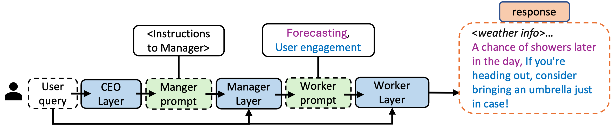

# HMAW: Hierarchical Multi-Agent Workflow for Prompt Optimization

This repository contains the implementation of the Hierarchical Multi-Agent Workflow (HMAW) for prompt optimization in large language models (LLMs).



---

## Prerequisites

Before running the scripts, ensure you have Python installed along with the necessary packages. You can install these packages using the provided requirements file.

#### Required Packages

- fire==0.5.0
- ipython==8.12.3
- numpy==1.26.4
- openai==1.30.4
- pandas==2.2.2
- setuptools==68.2.2
- tqdm==4.66.1

#### :wrench: Installation

To install the required packages, execute the following command:

```bash
pip install -r requirements.txt
```

#### :wrench: vLLM Model Installation

For installing and running the Mixtral model using vLLM, refer to the official [vLLM documentation](https://docs.vllm.ai/en/stable/).


---

## Directory Structure Preparation

To utilize the provided scripts effectively, please organize your data according to the following directory structure:

```
├── data
│   ├── Education
│   ├── FED
│   ├── GSM8K
│   ├── ATLAS
│   └── CodeNet
├── log
│   ├── compare_ATLAS_HMAW_base_mixtral_gpt3.5.json
│   ├── response_ATLAS_HMAW_mixtral.json
│   ├── response_ATLAS_base_mixtral.json
│   ├── compare_Education_HMAW_base_mixtral_gpt3.5.json
│   ├── response_Education_HMAW_mixtral.json
│   ├── response_Education_base_mixtral.json
│   └── ...
├── eval_ATLAS.py
├── ...
├── eval_compare.py
├── eval_correctness.py
└── ...
```

#### Log Files Description

- `compare_ATLAS_HMAW_base_mixtral_gpt3.5.json`: Contains comparison results of evaluator preferences between responses generated using HMAW prompts and basic user queries. The `mixtral` model is the LLM agent, and `gpt3.5` is the evaluator.
  
- `response_Education_HMAW_mixtral.json`: Contains responses generated using the HMAW method with the `mixtral` model as the agent.

#### Note
- The `log` directory contains detailed comparison and response logs for various models and methods.
- The root directory includes essential evaluation scripts (`eval_ATLAS.py`, `eval_compare.py`, `eval_correctness.py`, etc.).

By maintaining this structure, you ensure that the scripts can locate and process the data and logs correctly, facilitating seamless evaluation and comparison of model responses.

---


## How to Run

#### :wrench: Generate Responses

To execute prompt optimization and response generation, use the following command:

```bash
python eval_{dataset}.py
```

Replace `{dataset}` with one of the following options to represent different datasets: `ATLAS`, `education`, `fed`, `codenet`, or `GSM`.

#### :wrench: Test

Testing on `ATLAS`, `education`, `fed`, and `codenet`:

Run the following command:

```bash
python eval_compare.py
```

Please ensure to update the related file names in `eval_compare.py` to test under various settings.

Testing on `GSM`： 

Run the following command:

```bash
python eval_correctness.py
```


#### Customizing Prompting Methods

For details on how to change the prompting methods used in response generation, please refer to the `prompter.py` file.

---

## Citation
If you find our code helpful, please consider citing our paper:

```bibtex
@misc{liu2024hierarchical,
      title={Towards Hierarchical Multi-Agent Workflows for Zero-Shot Prompt Optimization}, 
      author={Yuchi Liu and Jaskirat Singh and Gaowen Liu and Ali Payani and Liang Zheng},
      year={2024},
      eprint={2405.20252},
      archivePrefix={arXiv},
      primaryClass={cs.CL}
}
```

## License

This project is open source and available under the [MIT License](LICENSE.md).

